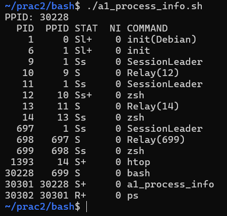
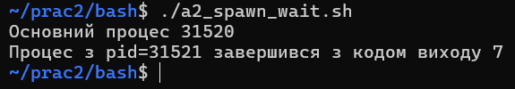
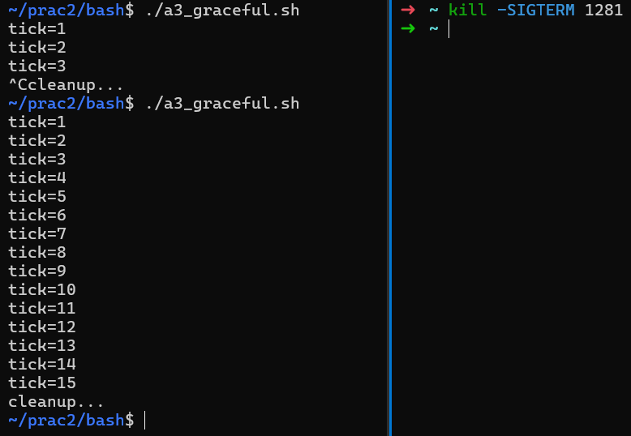
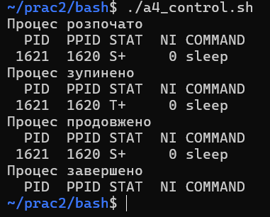
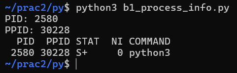
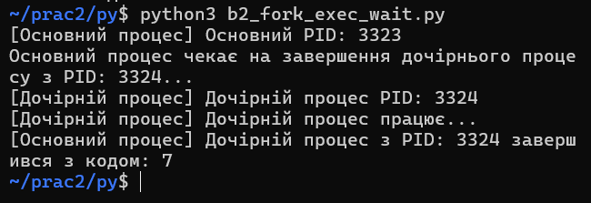
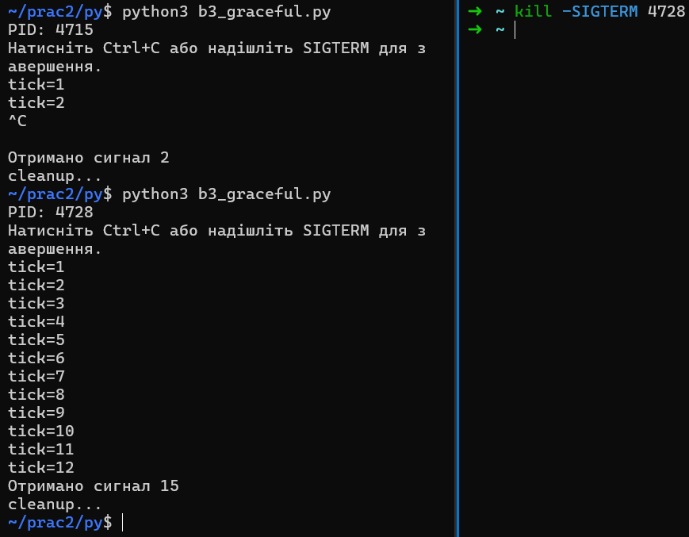
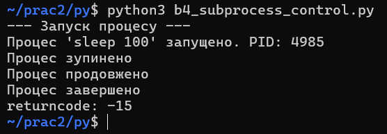
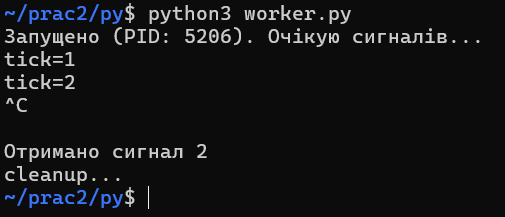
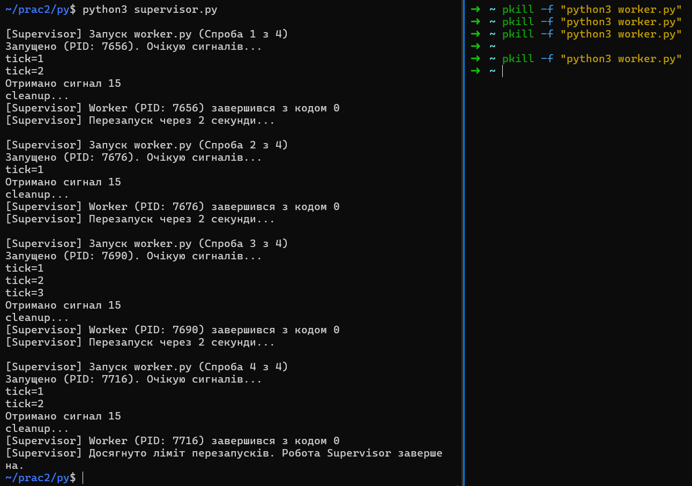

# Практична робота № 2

## Частина A (bash)

### A1. Інформація про процес (PID/PPID/STATE)

### A2. Spawn + wait (дочірній процес у фоні)

### A3. Graceful shutdown через trap

### A4. STOP/CONT і завершення процесу (TERM/KILL)

## Частина B (python)

### B1. Інформація про процес (PID/PPID/STATE)

### B2. fork + exec + wait (демонстрація моделі Unix)

### B3. Graceful shutdown через signal handler

### B4. Керування процесом через Python (subprocess + signals)

## Частина C (Supervisor)

## C1. Supervisor у Python (перезапуск процесу з лімітом)

# worker

# supervisor

